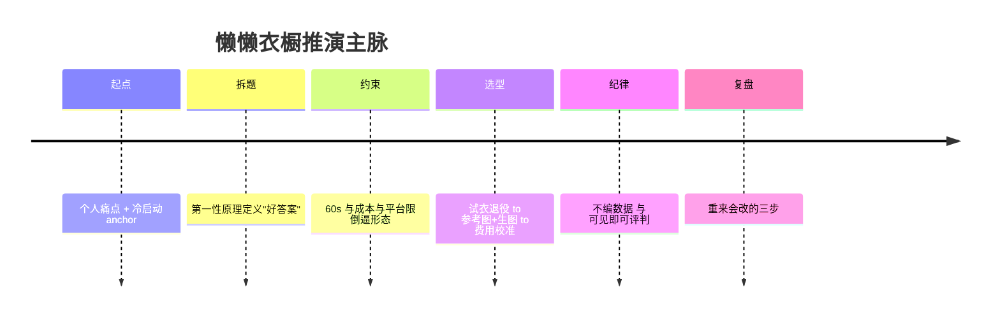
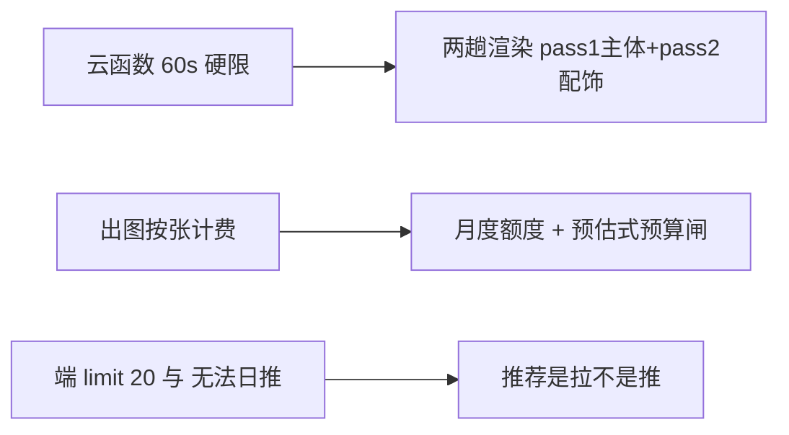
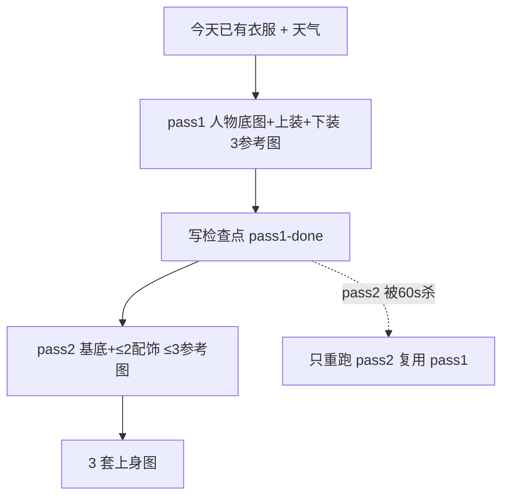

# 懒懒衣橱诞生记：一个 AI 产品是怎么被"约束"出来的

> 这不是技术教程，也不是 PRD，而是一个 PM / 产品人从 0 推演一个 AI 穿搭产品的**决策实录**——把每一步"为什么这么走"摊开给你看。仓库里的代码和 ADR 是证据，这篇是叙事。

我给自己做了一款穿衣搭子「懒懒衣橱」：为一个人、一天、已有的衣服，收敛出 3 套能直接出门的搭配，还带 AI 上身图。听起来像"又一个小程序"？真正有意思的不在功能，而在**它长成什么样，几乎不是我选的，是被一堆真实约束一点点捏出来的**。

下面这条时间线，是它从念头到落地的主脉：

## §0 起点：为什么是"懒懒衣橱"

我 166cm / 45kg，窄肩、黄皮，雷区是露背和荧光色，偏好长裤加紧身内搭。大多数人做"智能穿搭"会先想模型，我先把**自己**当成唯一数据源：身高体重、身形、肤色、雷区、偏好，直接编码成推荐的权重。没有用户画像？**你自己就是第一份画像**。

产品边界也由此定死：不是"无穷搭配生成器"，而是"为一个人、一天、已有衣服，收敛出 3 个能直接出门的答案"。

> **PM 可迁移结论**：冷启动最怕"没数据"。把你自己、你的真实约束，当作第一份也是最硬的一份数据——比任何泛化模型都准。

## §1 第一性原理：把问题拆到不能再拆

我没急着选技术，先定义"什么叫一个好答案"。推荐系统的本质，被我拆成一句话：

> 在「已有衣服 + 当天约束（天气 / 场景 / 心情）」里，收敛出 **3 个能直接出门的答案**。

为什么是 3 个不是 1 个或 10 个？1 个像独裁，10 个像甩锅；3 个给决策权又不至于过载。这一步没写一行代码，但后面所有技术选型都挂在它上面。

> **PM 可迁移结论**：先定义"什么叫一个好答案"，再想"用什么技术"。前者错了，后者越快越偏。

## §2 技术约束如何倒逼产品形态

这是全文最值钱的一节。很多 AI 产品文档只写"我们用了 X"，从不写"为什么只能用 X"。懒懒衣橱的形态，是被三个平台硬限**雕刻**出来的。

**① 云函数 60s → 两趟渲染。** 微信云函数单次执行硬上限 60 秒（`-504003` 超时即此约束的具象）。一趟生图想把"人物底图 + 上装 + 下装 + 配饰"全塞进多张参考图合成，时间根本不够。唯一的出路是拆：**pass1 出人物底图 + 上装 + 下装（3 张参考图），pass2 在基底上补 ≤2 件配饰（≤3 张参考图）**。两段独立缓存键，pass1 出图先写检查点，pass2 被 60s 硬杀时只需重跑配饰、不重花 pass1 的钱。这个决策固化在 [ADR-0018](docs/adr/0018-two-pass-render.md)。

**② 出图成本 → 月度额度。** 生图按张计费，敞开口用会失控。于是额度"按北京时间算月"，预算闸做成"预估式"——判据是"已花 + 预估 > 预算"才拦，而不是等超了再拦（详见 [ADR-0004](docs/adr/0004-on-demand-look-image-with-quota.md)）。一次完整演绎两趟、最多 2 张上身图，月上限 60 张。

**③ 平台静默截断 / 无法日推 → 拉非推。** 端上单次拉取默认上限 20 条、且无法主动给用户体验版日推。这意味着"主动推送穿搭"在产品上不成立，推荐只能是"用户来拉"。边界不是我想的，是平台给的。

> **PM 可迁移结论**：约束不是障碍，是产品形态的雕刻刀。先把平台的硬限列清楚，产品的样子往往自己就浮现了。

## §3 模型选型的三次转向

选型从不是一锤定音。

**第一转：试衣（aitryon）退役。** 这条路不是被效果打死的——真机反馈里"衣服不像"根本不在抱怨清单上，保真度其实是兑现的。它死在两个更硬的理由上：

- **覆盖率结构性不足**：aitryon 接口只有 top + bottom 两个槽位，而一套搭配按设计最多 7 件（内搭×2 + 外套 + 下装 + 鞋 + 包 + 配饰），画面只能覆盖约 1/3；外套一占主槽还会把叠穿的内搭整体挤掉。用户要的是"整套级"答案（看这身能不能出门），2/7 的覆盖率靠迁移或调参都救不回——连 `qwen-image-3.0` 的参考图上限也只有 3 张。
- **它是条 30 天后必断的死链**：aitryon 与 aitryon-plus 已列入阿里云百炼 **2026-10-10 的下线清单**，且**没有对等专用试衣模型**可换。

2026-09-10 我把推荐页从"试衣 + 演绎"双按钮收回单按钮"演绎"，保真诉求改由演绎链路承担（见模型退役跟踪 [ADR-0019](docs/adr/0019-retire-virtual-tryon.md)）。

**第二转：万相 / Qwen 取舍。** 演绎（上身图）最终落在阿里云百炼的 `qwen-image-3.0`，LLM 走硅基流动的 `DeepSeek-V3`，天气接高德。provider 做成可插拔，换模型不碰业务代码。

**第三转，也是最贵的一转：费用口径校准。** 一开始我按"1 张参考图"算单价，得出 ¥0.20/张；后来发现一趟实际喂 3 张参考图，应是 ¥0.24/趟；再后来确认**演绎走两趟**，一趟 ¥0.24 × 2 = **¥0.48/次完整演绎**（详见 [README §费用](README.md)）。这串数字本身就是"不拍脑袋"的证据——口径错了，整张成本表都得返工。

> **PM 可迁移结论**：成本口径从第一天就按"真实链路"建模，别按"理想的一张图"建模。选型会议纪要里写下费用公式，比写下模型名字重要。

## §4 最贵的一课：不编数据

这条产品里，"不编数据"不是事后补的纪律，而是从第一处设计就落地：韩系灵感案例库经"双闸"（季节交集 + 可满足性）筛选后才署名；**硬约束凑不齐就诚实降级，绝不硬凑**——宁可少一条推荐，也不编一条没来源的（见 [ADR-0012](docs/adr/0012-inspo-constraint-and-temperature-dual-gate.md)）。

我也不是一开始就守得住。方案里曾有一句"多数用户每月实际出图 2–4 张"，读着很丰满，但我压根没做过这个调查。

**删了。** 再好看的断言，没有来源就不能写——这是我差点踩空、又及时拉回来的最贵一课。

> **PM 可迁移结论**：没有调查的数字，再好看也不能写。编一个，读者信了一次，信任就永久打折。

## §5 把"可见的 AI = 可被评判的 AI"做成铁律

AI 给了答案，用户凭什么信？我的铁律是：**凡云端读了哪个值决定了结果，就把实际取用的值回传前端自证**。具体落地成三件事——

- 部署 `build` 版本号双方都印，避免"云端比前端新"却误报；
- 缓存键即输入（输入变了键就变），偶发错误不会被缓存固化成常发；
- `promptUsed` 取景句回传，鞋到底进没进画面，用户能反向验证。

provenance 走双轨记录（[ADR-0008](docs/adr/0008-dual-track-provenance-and-transfer-mapping.md) / [ADR-0009](docs/adr/0009-garment-image-must-enter-generation.md)）。

> **PM 可迁移结论**：可被评判的 AI 才可被信任。把"云端读了什么"摊开，比"模型很准"的话术值钱。

## §6 交付是作品的最后一公里

前面所有的决策，落到"能跑起来"才算数。本文主张"可见的 AI = 可被评判的 AI"，那这个仓库本身也得经得起评判——它不在 PPT 里，在 GitHub 上：[lazy-wardrobe-engineering](https://github.com/Wang-lanlan/lazy-wardrobe-engineering)。clone 下来、读 ADR、跑测试门，每一步都能验，这才是"作品"与"方案"的分界。

为了让"可被评判"不停留在口号，工程上落了两件事：页面控制器做成**可离线测**（桩 `Page` / `wx`，不依赖微信运行时就能跑断言）；关键逻辑加**反向验证门**——把被守卫的条件短路回旧写法，相关测试必须转红，才能证明这门真在守东西。

> **PM 可迁移结论**：方案停在 PPT 上很美，能 clone 跑起来才是作品。

## §7 复盘：重来会改哪三步

1. **早把"两趟"当结构性约束**，而不是临时方案——省下回头重构。
2. **费用口径从第一天按两趟建模**，别等成本表返工。
3. **案例库准入闸前置**，双闸在注入前就拦，而非事后补救降级。

## §8 证据索引

- 两趟渲染：[ADR-0018](docs/adr/0018-two-pass-render.md)
- 月度额度：[ADR-0004](docs/adr/0004-on-demand-look-image-with-quota.md)
- 试衣退役：[ADR-0019](docs/adr/0019-retire-virtual-tryon.md)
- 案例库双闸：[ADR-0012](docs/adr/0012-inspo-constraint-and-temperature-dual-gate.md)
- 可见即可评判：[ADR-0008](docs/adr/0008-dual-track-provenance-and-transfer-mapping.md) · [ADR-0009](docs/adr/0009-garment-image-must-enter-generation.md)
- 费用口径：[README §费用](README.md)
- 品牌与画像：[DESIGN.md](DESIGN.md) · [CONTEXT.md](CONTEXT.md) · [DEPLOY.md](DEPLOY.md)
